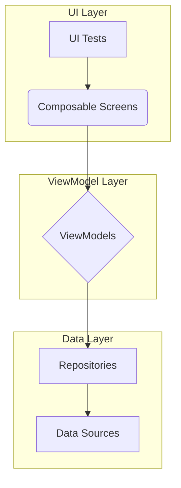
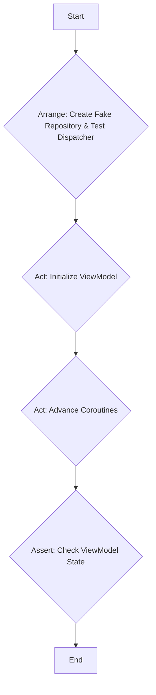
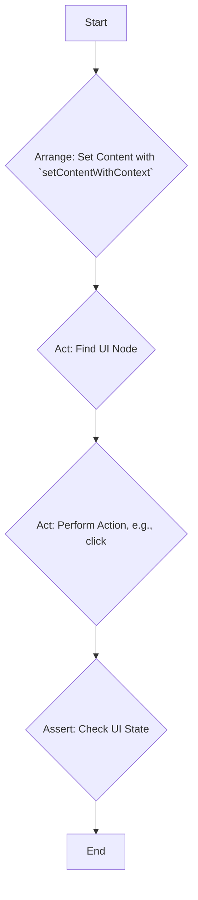

# Testing Guidelines

This document provides guidelines for writing tests in the eCommerceApp project. The goal is to maintain a consistent and effective testing strategy across the codebase.

## General Principles

### Naming Conventions

Test functions should be named using backticks and descriptive sentences that clearly state the purpose of the test. This makes it easy to understand the test's intent without reading the implementation.

```kotlin
@Test
fun `When products are fetched successfully then state is Success with products`() { ... }

@Test
fun `When isLoading is true then the loading overlay should be displayed`() { ... }
```

### Test Structure

Tests should follow the **Arrange-Act-Assert** pattern:

-   **Arrange**: Set up the test environment, including any necessary objects, mocks, or initial state.
-   **Act**: Execute the code being tested.
-   **Assert**: Verify that the outcome is as expected.

### Testing Strategy Overview



## Unit Tests

Unit tests are used to test individual components, such as data models and business logic. They should be small, fast, and isolated.

-   **Framework**: Use the `kotlin.test` library for assertions (`assertEquals`, `assertTrue`, etc.).
-   **Coverage**: Test different scenarios, including valid inputs, edge cases (e.g., zero, negative values), and operations.

### Example: `DollarAmountTest.kt`

```kotlin
import kotlin.test.Test
import kotlin.test.assertEquals

class DollarAmountTest {

    @Test
    fun `Plus operation`() {
        // Arrange
        val amount1 = DollarAmount("10.50")
        val amount2 = DollarAmount("5.25")

        // Act
        val sum = amount1 + amount2

        // Assert
        assertEquals("15.75", sum.toString())
    }
}
```

## ViewModel Tests

ViewModel tests are crucial for verifying the UI logic and state management. They should be run as unit tests, without needing a UI.

-   **Coroutines**: Use `kotlinx.coroutines.test.runTest` to test suspend functions and coroutines.
-   **Dispatcher**: Use a `StandardTestDispatcher` to control the execution of coroutines.
-   **Fakes/Mocks**: Use fake implementations of repositories or other dependencies to isolate the ViewModel.
-   **State**: Assert the state of the `StateFlow` (`viewModel.state.value`) to verify that the ViewModel behaves as expected.

### ViewModel Test Flow



### Example: `ProductListViewModelTest.kt`

```kotlin
@OptIn(ExperimentalCoroutinesApi::class)
class ProductListViewModelTest {

    @Test
    fun `When products are fetched successfully then state is Success with products`() = runTest {
        // Arrange
        val mockProducts = ...
        val fakeProductRepository = FakeProductRepository(fetchProductsLambda = {
            Result.success(mockProducts)
        })
        val testDispatcher = StandardTestDispatcher(testScheduler)

        // Act
        val viewModel = ProductListViewModel(
            productRepository = fakeProductRepository,
            dispatcher = testDispatcher
        )
        advanceUntilIdle() // Let the coroutine finish

        // Assert
        val finalState = viewModel.state.value
        assertIs<ProductListUiState.Success>(finalState)
        assertEquals(mockProducts, finalState.products)
    }
}
```

## UI (Composable) Tests

UI tests are used to verify the behavior of your Composable functions. They should be run on a UI thread.

-   **Framework**: Use `@OptIn(ExperimentalTestApi::class)` and `runComposeUiTest`.
-   **Test Rules**: Use the `UiTest` base class to set up the test environment.
-   **Content**: Use the `setContentWithContext` function to set the content of the test.
-   **Finding Nodes**: Use `onNodeWithTag`, `onNodeWithContentDescription`, and `onNodeWithText` to find UI elements.
-   **Test Tags**: Use the `TestTags` object to define reusable test tags for your Composables.
-   **Assertions**: Use assertions like `assertIsDisplayed`, `assertDoesNotExist`, and `assertIsEnabled` to verify the state of the UI.
-   **Interactions**: Simulate user interactions with `performClick`, `performScroll`, etc.

### UI Test Flow



### Example: `ProductListScreenTest.kt`

```kotlin
@OptIn(ExperimentalTestApi::class)
class ProductListScreenTest : UiTest() {

    @Test
    fun `When state is loading then loading overlay is displayed`() = runComposeUiTest {
        // Arrange
        setContentWithContext {
            ProductListScreen(ProductListUiState.Loading)
        }

        // Assert
        onNodeWithTag(TestTags.loadingOverlay).assertIsDisplayed()
    }
}
```

## Test Infrastructure

The project includes a simple test infrastructure to abstract platform-specific setup for UI tests.

-   **`UiTest`**: An `expect` class that provides a common base for UI tests.
-   **`setContentWithContext`**: An `expect` function that sets the content of the test, a`llowing for platform-specific setup (e.g., setting a theme).

By following these guidelines, we can ensure that our tests are consistent, effective, and easy to maintain.
