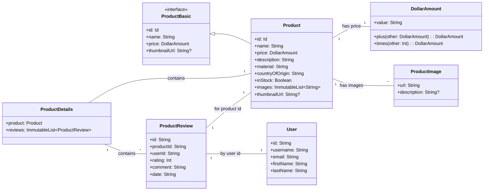

# Architecture Overview: `io.aoriani.ecomm.data.model` Package

This document provides an architectural overview of the data model classes within the `io.aoriani.ecomm.data.model` package. These classes represent the core entities and their relationships in the e-commerce application, designed for clarity, type safety, and efficient serialization.

## 📦 Package Purpose

The `io.aoriani.ecomm.data.model` package encapsulates the fundamental data structures used throughout the application. It defines how products, users, reviews, and monetary amounts are represented, ensuring consistency and facilitating data exchange between different layers of the application (e.g., UI, data sources, network).

## 📊 Class Diagram

Here's a Mermaid class diagram illustrating the relationships between the key model classes:

## 📝 Class Descriptions

### `ProductBasic` (Interface)

An interface defining the fundamental properties common to all product representations. It ensures that any product object provides a unique identifier, a name, a price, and a thumbnail URL.

-   **`id: ProductBasic.Id`**: Unique identifier for the product.
-   **`name: String`**: The name of the product.
-   **`price: DollarAmount`**: The price of the product.
-   **`thumbnailUrl: String?`**: URL for a thumbnail image, can be null.

### `Product` (Data Class)

Represents a detailed product, extending `ProductBasic` with comprehensive information such as description, material, country of origin, stock status, and a list of image URLs.

-   **`id: ProductBasic.Id`**: Inherited from `ProductBasic`.
-   **`name: String`**: Inherited from `ProductBasic`.
-   **`price: DollarAmount`**: Inherited from `ProductBasic`.
-   **`description: String`**: Detailed description of the product.
-   **`material: String`**: Primary material of the product.
-   **`countryOfOrigin: String`**: Country of manufacture.
-   **`inStock: Boolean`**: Indicates if the product is in stock.
-   **`images: ImmutableList<String>`**: List of image URLs.
-   **`thumbnailUrl: String?`**: Derived from the first image in `images`, inherited from `ProductBasic`.

### `DollarAmount` (Expect Class)

A value class representing a monetary amount in dollars. It's an `expect` class, meaning its actual implementation is platform-specific (e.g., for handling currency precision and operations). It includes serialization logic to handle string representations.

-   **`value: String`**: The string representation of the dollar amount.
-   **`plus(other: DollarAmount): DollarAmount`**: Adds two `DollarAmount` instances.
-   **`times(other: Int): DollarAmount`**: Multiplies a `DollarAmount` by an integer.

### `ProductDetails` (Data Class)

Aggregates a `Product` object with a list of its associated `ProductReview`s, providing a complete view of a product's details including user feedback.

-   **`product: Product`**: The detailed product information.
-   **`reviews: ImmutableList<ProductReview>`**: A list of reviews for the product.

### `ProductImage` (Data Class)

Represents a single image associated with a product, including its URL and an optional description.

-   **`url: String`**: The URL of the image.
-   **`description: String?`**: Optional descriptive text for the image.

### `ProductReview` (Data Class)

Represents a user's review for a specific product, including rating, comment, and submission date. It links to a product and a user via their IDs.

-   **`id: String`**: Unique identifier for the review.
-   **`productId: String`**: ID of the product being reviewed.
-   **`userId: String`**: ID of the user who wrote the review.
-   **`rating: Int`**: The rating given (e.g., 1-5).
-   **`comment: String`**: The textual content of the review.
-   **`date: String`**: The submission date in ISO 8601 format.

### `User` (Data Class)

Represents a user profile in the e-commerce application, containing basic identification and contact information.

-   **`id: String`**: Unique identifier for the user.
-   **`username: String`**: The user's chosen username.
-   **`email: String`**: The user's email address.
-   **`firstName: String`**: The user's first name.
-   **`lastName: String`**: The user's last name.
