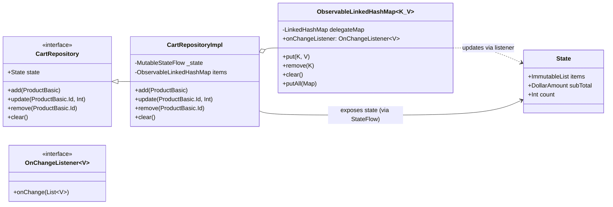
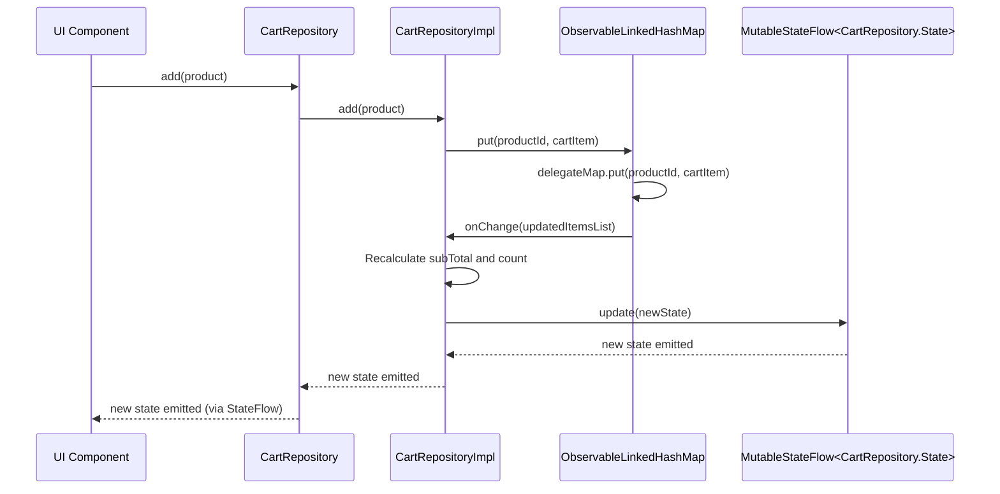

# Cart Repository Architecture Documentation

This document details the architecture of the `CartRepository` module, outlining its components,
their responsibilities, and how they interact to manage the application's shopping cart state.

## 1. Overview

The `CartRepository` is a crucial part of the application's data layer, responsible for managing the
state of the user's shopping cart. It provides a clear API for adding, updating, and removing items,
and exposes the cart's current state via a `StateFlow`.

## 2. Core Components

The `CartRepository` module is composed of the following key components:

* **`CartRepository` (Interface)**: Defines the contract for cart operations and the structure of
  the cart's state.
* **`CartRepositoryImpl` (Implementation)**: The concrete implementation of `CartRepository`,
  handling the business logic for cart management.
* **`ObservableLinkedHashMap` (Utility Class)**: A specialized `LinkedHashMap` that notifies
  registered listeners whenever its contents change. This is used internally by `CartRepositoryImpl`
  to maintain the order of cart items and trigger state updates.

## 3. Architectural Diagram

The following diagram illustrates the relationships between these components:



## 4. Component Details

### `CartRepository` Interface

This interface defines the public API for interacting with the shopping cart. It exposes a `State`
data class that encapsulates the cart's current items, subtotal, and total count. The `state`
property is a `StateFlow` that allows consumers to react to changes in the cart.

```kotlin
interface CartRepository {
    data class State(
        val items: ImmutableList<CartItem>,
        val subTotal: DollarAmount,
        val count: Int
    )

    val state: StateFlow<State>
    fun add(product: ProductBasic)
    fun update(productId: ProductBasic.Id, quantity: Int)
    fun remove(productId: ProductBasic.Id)
    fun clear()
}
```

### `CartRepositoryImpl`

This class provides the concrete implementation of the `CartRepository` interface. It uses an
`ObservableLinkedHashMap` to store `CartItem`s, ensuring that the order of items is preserved.

Key aspects of `CartRepositoryImpl`:

* **Internal State Management**: It maintains a `MutableStateFlow` (`_state`) which is updated
  whenever the underlying `items` (the `ObservableLinkedHashMap`) change.
* **`ObservableLinkedHashMap` Integration**: It sets itself as the `onChangeListener` for the
  `ObservableLinkedHashMap`. When `onChange` is triggered, it recalculates the `subTotal` and
  `count` and updates the `_state` `MutableStateFlow`.
* **Business Logic**: Implements the `add`, `update`, `remove`, and `clear` methods, handling the
  logic for modifying cart items. For `add`, it checks if the product already exists and increments
  the quantity, or adds a new `CartItem`. For `update`, it handles quantity changes, including
  removing the item if the quantity becomes zero.

### `ObservableLinkedHashMap`

This is a utility class that extends `LinkedHashMap` functionality by providing a callback mechanism
for changes.

Key aspects of `ObservableLinkedHashMap`:

* **Change Listener**: It exposes an `onChangeListener` property of type
  `ObservableLinkedHashMap.OnChangeListener`.
* **Notification on Modification**: Overrides methods like `put`, `remove`, `clear`, and `putAll` to
  invoke the `onChangeListener` after the underlying `delegateMap` (a `LinkedHashMap`) has been
  modified. This ensures that any component observing this map is immediately aware of changes.

## 5. Data Flow and Interactions

The following sequence diagram illustrates a typical interaction, such as adding a product to the
cart:



When a product is added:

1. The UI calls `add(product)` on the `CartRepository` interface.
2. `CartRepositoryImpl` receives the call and interacts with its internal `ObservableLinkedHashMap`.
3. The `ObservableLinkedHashMap` performs the `put` operation on its `delegateMap`.
4. After the map is updated, `ObservableLinkedHashMap` triggers its `onChangeListener`, notifying
   `CartRepositoryImpl`.
5. `CartRepositoryImpl` recalculates the `subTotal` and `count` based on the updated list of items.
6. Finally, `CartRepositoryImpl` updates its `MutableStateFlow` (`_state`), which in turn emits the
   new `CartRepository.State` to any collectors (e.g., UI components observing
   `CartRepository.state`).

This architecture ensures a reactive and observable cart state, allowing UI components to
automatically update when the cart's contents change.
