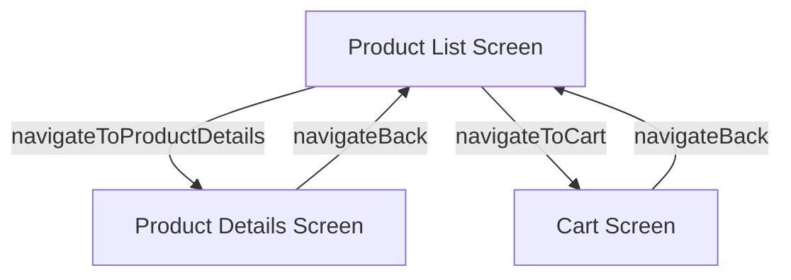

# Application Navigation Flow

Here's a diagram illustrating the navigation paths within your application, based on the provided `navigation.kt` files, including the navigation actions.

### Explanation of Routes:

*   **Product List Screen (`Routes.ProductList`)**: This is the starting point of your application. It displays a list of products.
    *   From here, users can navigate to the **Product Details Screen** for a specific product using `navigateToProductDetails`.
    *   Users can also navigate directly to the **Cart Screen** using `navigateToCart`.

*   **Product Details Screen (`Routes.ProductDetails`)**: This screen shows detailed information about a selected product. It takes `id`, `name`, and `imageUrl` as arguments.
    *   From here, users can navigate back to the **Product List Screen** using `navigateBack`.

*   **Cart Screen (`Routes.Cart`)**: This screen displays the items currently in the user's shopping cart.
    *   From here, users can navigate back to the **Product List Screen** using `navigateBack`.

### Navigation Actions:

*   `navController.navigate(Routes.Cart)`: Navigates to the Cart Screen.
*   `navController.navigate(Routes.ProductDetails(id, name, imageUrl))`: Navigates to the Product Details Screen with product information.
*   `navController.popBackStack()`: Navigates back to the previous screen in the navigation stack.

This diagram and explanation accurately reflect the navigation structure defined in your current `navigation.kt` files. Let me know if you need any further analysis!
