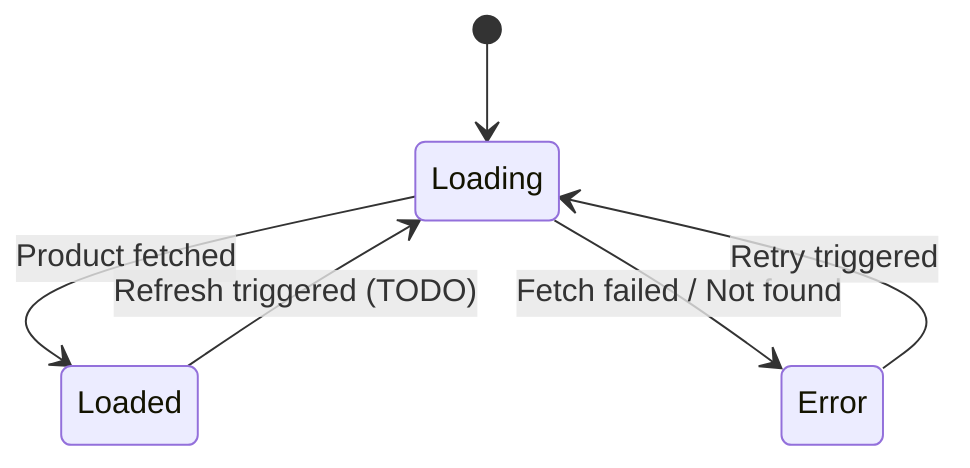
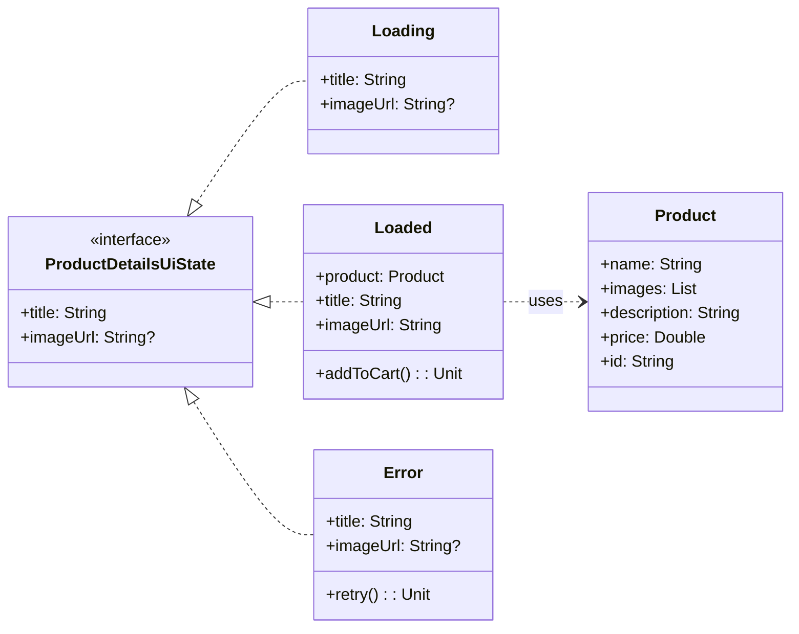

# Product Details UI State & ViewModel Documentation

This document describes the UI states for the Product Details screen, as defined in
`ProductDetailsUiState.kt`, and how they are managed by `ProductDetailsViewModel.kt`.

## Overview

`ProductDetailsUiState` is a sealed interface representing the different visual states of the
Product Details screen. The `ProductDetailsViewModel` is responsible for fetching product data and
updating the UI state accordingly. It exposes the current state via a
`kotlinx.coroutines.flow.StateFlow`.

## State Diagram (DFA)

## Class Diagram

## Detailed State Descriptions

### `ProductDetailsUiState.Loading`

*   **Purpose:** Indicates that the product details are currently being fetched from the repository.
    The UI should typically display a loading indicator.
*   **Data:**
    *   `title: String`: The name of the product, initially passed via navigation arguments.
    *   `imageUrl: String?`: The URL of the product's image, initially passed via navigation
        arguments.
*   **ViewModel Transition:** This is the initial state set in `ProductDetailsViewModel` when it's
    created and begins the `fetchProductDetails()` operation. It's also transitioned to when a retry or refresh is initiated.

### `ProductDetailsUiState.Loaded`

*   **Purpose:** Indicates that the product details have been successfully fetched and are available
    for display.
*   **Data:**
    *   `product: Product`: The complete `Product` object containing all details.
    *   `title: String`: Derived from `product.name`.
    *   `imageUrl: String`: Derived from `product.images.firstOrNull().orEmpty()`.
*   **Actions:**
    *   `addToCart(): Unit`: Triggers the action to add the current product to the shopping cart by invoking a private lambda (`_addToCart`) provided by the ViewModel.
*   **ViewModel Transition:** The ViewModel transitions to this state when
    `productRepository.getProduct(route.id)` returns a non-null `Product` successfully.

### `ProductDetailsUiState.Error`

*   **Purpose:** Indicates that an error occurred while trying to fetch the product details (e.g.,
    network error, product not found).
*   **Data:**
    *   `title: String`: The name of the product (from navigation arguments), used as a fallback.
    *   `imageUrl: String?`: The URL of the product's image (from navigation arguments), used as a
        fallback.
*   **Actions:**
    *   `retry(): Unit`: Triggers the action to retry fetching the product details by invoking a private lambda (`_retry`) provided by the ViewModel.
*   **ViewModel Transition:** The ViewModel transitions to this state if
    `productRepository.getProduct(route.id)` returns `null` or the operation
    `onFailure` (e.g., throws a `ProductRepository.GraphQlException`).

## ViewModel State Management

The `ProductDetailsViewModel` manages the UI state transitions.

*   It initializes the state to `ProductDetailsUiState.Loading` using `route.name` and
    `route.imageUrl` from the `SavedStateHandle`.
*   The `fetchProductDetails()` private function is called upon initialization and when `retry()` is invoked from the `Error` state. Inside this function:
    *   It first updates the state to `ProductDetailsUiState.Loading`.
    *   It calls `productRepository.getProduct(productDetailsRoute.id)`. This function returns a `Result<Product?>`.
    *   On a successful response (`onSuccess`) with a non-null `Product`, it updates the `state` flow to `ProductDetailsUiState.Loaded(product, _addToCart = ::addToCart)`.
    *   If the `Product` is `null` or the operation `onFailure` (e.g., throws a `ProductRepository.GraphQlException`), it updates the `state` flow to `ProductDetailsUiState.Error(..., _retry = ::fetchProductDetails)`.
*   The `addToCart()` function in the ViewModel is responsible for handling the "add to cart" logic. It ensures that the current UI state is `ProductDetailsUiState.Loaded` before calling `addToCartUseCase(currentUiState.product)`.
