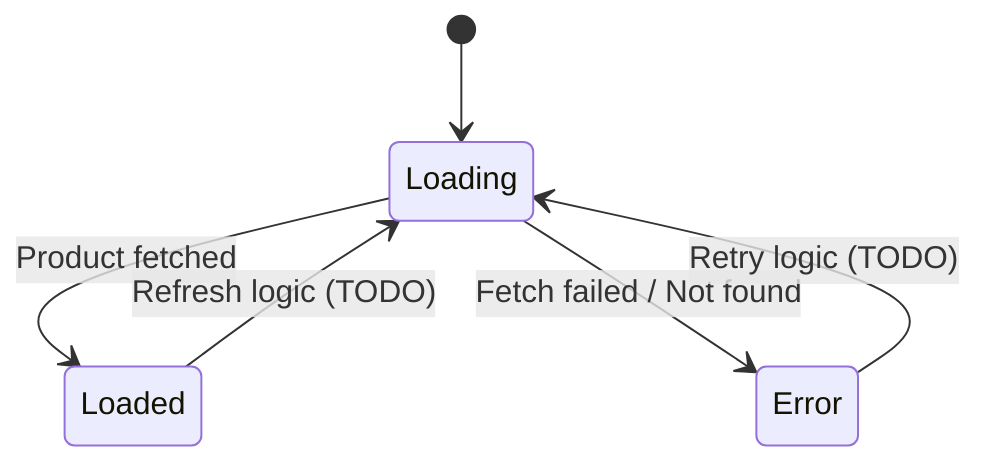
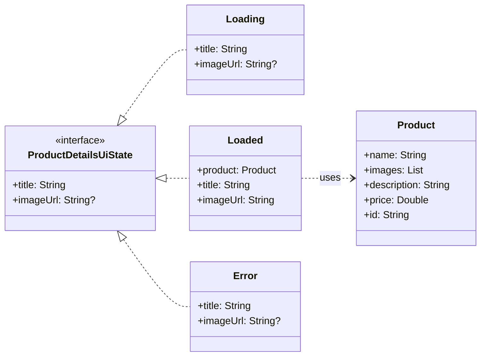

# Product Details UI State & ViewModel Documentation

This document describes the UI states for the Product Details screen, as defined in
`ProductDetailsUiState.kt`, and how they are managed by `ProductDetailsViewModel.kt`.

## Overview

`ProductDetailsUiState` is a sealed interface representing the different visual states of the
Product Details screen. The `ProductDetailsViewModel` is responsible for fetching product data and
updating the UI state accordingly. It exposes the current state via a
`kotlinx.coroutines.flow.StateFlow`.

## State Diagram (DFA)

## Class Diagram

## Detailed State Descriptions

### `ProductDetailsUiState.Loading`

* **Purpose:** Indicates that the product details are currently being fetched from the repository.
  The UI should typically display a loading indicator.
* **Data:**
    * `title: String`: The name of the product, initially passed via navigation arguments.
    * `imageUrl: String?`: The URL of the product's image, initially passed via navigation
      arguments.
* **ViewModel Transition:** This is the initial state set in `ProductDetailsViewModel` when it's
  created and begins the `fetchProductDetails()` operation.

### `ProductDetailsUiState.Loaded`

* **Purpose:** Indicates that the product details have been successfully fetched and are available
  for display.
* **Data:**
    * `product: Product`: The complete `Product` object containing all details.
    * `title: String`: Derived from `product.name`.
    * `imageUrl: String`: Derived from `product.images.firstOrNull().orEmpty()`.
* **ViewModel Transition:** The ViewModel transitions to this state when
  `productRepository.getProduct(route.id)` returns a non-null `Product`.

### `ProductDetailsUiState.Error`

* **Purpose:** Indicates that an error occurred while trying to fetch the product details (e.g.,
  network error, product not found).
* **Data:**
    * `title: String`: The name of the product (from navigation arguments), used as a fallback.
    * `imageUrl: String?`: The URL of the product's image (from navigation arguments), used as a
      fallback.
* **ViewModel Transition:** The ViewModel transitions to this state if
  `productRepository.getProduct(route.id)` returns `null` or throws a
  `ProductRepository.GraphQlException`.

## ViewModel State Management

The `ProductDetailsViewModel` manages the UI state transitions.

* It initializes the state to `ProductDetailsUiState.Loading` using `route.name` and
  `route.imageUrl` from the `SavedStateHandle`.
* The `fetchProductDetails()` private function is called upon initialization. Inside this function:
    * It calls `productRepository.getProduct(route.id)`.
    * On a successful response with a non-null product, it updates the `state` flow to
      `ProductDetailsUiState.Loaded(product)`.
    * If the product is `null` or a `ProductRepository.GraphQlException` occurs, it updates the
      `state` flow to `ProductDetailsUiState.Error`.
