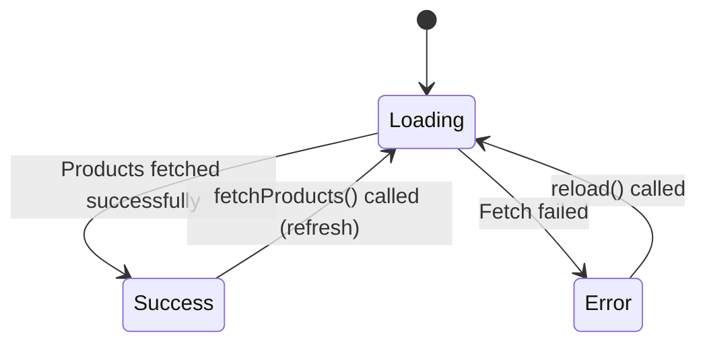
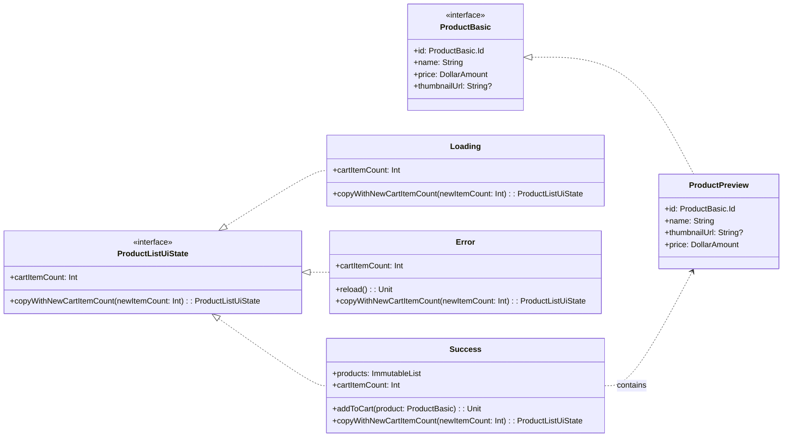

# Product List UI State & ViewModel Documentation

This document describes the UI states for the Product List screen, as defined in
`ProductListUiState.kt`, and how they are managed by `ProductListViewModel.kt`.

## Overview

`ProductListUiState` is a sealed interface representing the different visual states of the Product
List screen (e.g., when products are loading, successfully displayed, or an error has occurred). The
`ProductListViewModel` is responsible for fetching the list of product previews and updating the UI
state accordingly. It exposes the current state via a `kotlinx.coroutines.flow.StateFlow`. All states
include cart functionality with a `cartItemCount` property and the ability to add products to the cart.

## State Diagram (DFA)

## Class Diagram

## Detailed State Descriptions

### `ProductListUiState.Loading`

* **Purpose:** Indicates that the list of products is currently being fetched from the repository.
  The UI should typically display a loading indicator.
* **Data:**
    * `cartItemCount: Int`: The current number of items in the shopping cart (default: 0).
* **ViewModel Transition:** This is the initial state set in `ProductListViewModel` when it's
  created or when `fetchProducts()` is called.

### `ProductListUiState.Success`

* **Purpose:** Indicates that the list of product previews has been successfully fetched and is
  available for display.
* **Data:**
    * `products: ImmutableList<ProductPreview>`: An immutable list of `ProductPreview` objects.
    * `cartItemCount: Int`: The current number of items in the shopping cart (default: 0).
    * `_addToCart: (ProductBasic) -> Unit`: Private function for adding products to cart (exposed via `addToCart()` method).
* **Methods:**
    * `addToCart(product: ProductBasic)`: Adds the specified product to the shopping cart.
* **ViewModel Transition:** The ViewModel transitions to this state when
  `productRepository.fetchProducts()` successfully returns a `Result.success` with a list of products.

### `ProductListUiState.Error`

* **Purpose:** Indicates that an error occurred while trying to fetch the product list (e.g.,
  network error).
* **Data:**
    * `cartItemCount: Int`: The current number of items in the shopping cart (default: 0).
    * `_reload: () -> Unit`: Private function for retrying the fetch operation (exposed via `reload()` method).
* **Methods:**
    * `reload()`: Retries fetching the product list.
* **ViewModel Transition:** The ViewModel transitions to this state if
  `productRepository.fetchProducts()` returns a `Result.failure`.

## ViewModel State Management

The `ProductListViewModel` manages the UI state transitions and integrates with cart functionality.

**Dependencies:**
* `ProductRepository`: For fetching product data
* `CartRepository`: For monitoring cart state changes
* `AddToCartUseCase`: For adding products to the cart

**State Flow Initialization:**
* It initializes a `MutableStateFlow<ProductListUiState>` with `ProductListUiState.Loading()`.
* It observes `cartRepository.state` to automatically update `cartItemCount` across all states.

**The `fetchProducts()` function behavior:**
* Sets the state to `ProductListUiState.Loading` while preserving current `cartItemCount`.
* Calls `productRepository.fetchProducts()` which returns a `Result<ImmutableList<ProductPreview>>`.
* On `Result.onSuccess`: Updates state to `ProductListUiState.Success` with:
    * The fetched product list
    * Current `cartItemCount`
    * `_addToCart` function reference pointing to the ViewModel's `addToCart` method
* On `Result.onFailure`: Updates state to `ProductListUiState.Error` with:
    * Current `cartItemCount`
    * `_reload` function reference pointing to `fetchProducts` for retry functionality

**Cart Integration:**
* The `addToCart(product: ProductBasic)` method delegates to `AddToCartUseCase`
* Cart state changes are automatically reflected in all UI states through the cart repository observer
