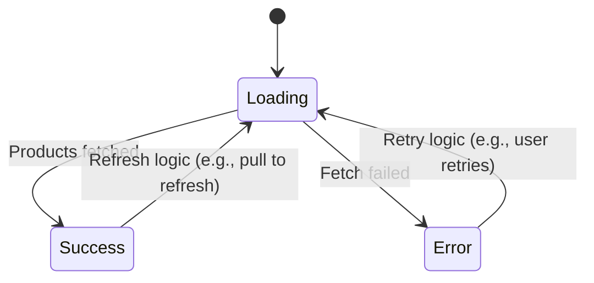
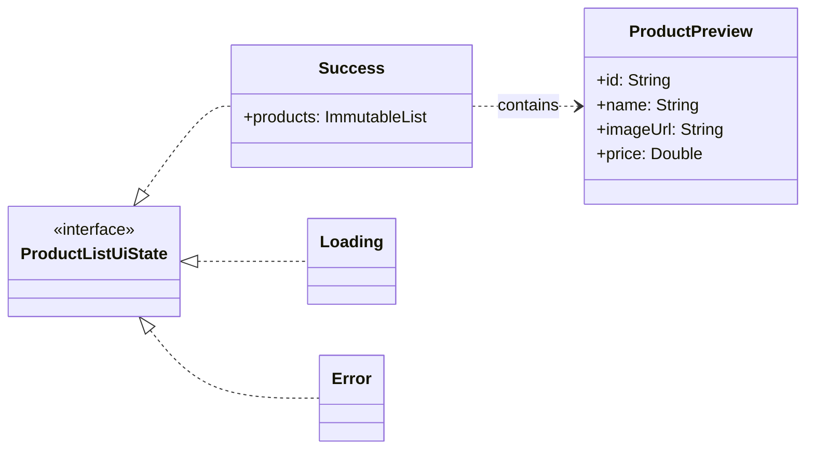

# Product List UI State & ViewModel Documentation

This document describes the UI states for the Product List screen, as defined in `ProductListUiState.kt`, and how they are managed by `ProductListViewModel.kt`.

## Overview

`ProductListUiState` is a sealed interface representing the different visual states of the Product List screen (e.g., when products are loading, successfully displayed, or an error has occurred). The `ProductListViewModel` is responsible for fetching the list of product previews and updating the UI state accordingly. It exposes the current state via a `kotlinx.coroutines.flow.StateFlow`.

## State Diagram (DFA)


## Class Diagram


## Detailed State Descriptions

### `ProductListUiState.Loading`
*   **Purpose:** Indicates that the list of products is currently being fetched from the repository. The UI should typically display a loading indicator.
*   **Data:** None.
*   **ViewModel Transition:** This is the initial state set in `ProductListViewModel` when it's created or when `fetchProducts()` is called.

### `ProductListUiState.Success`
*   **Purpose:** Indicates that the list of product previews has been successfully fetched and is available for display.
*   **Data:**
    *   `products: ImmutableList<ProductPreview>`: An immutable list of `ProductPreview` objects.
*   **ViewModel Transition:** The ViewModel transitions to this state when `productRepository.fetchProducts()` successfully returns a list of products.

### `ProductListUiState.Error`
*   **Purpose:** Indicates that an error occurred while trying to fetch the product list (e.g., network error).
*   **Data:** None.
*   **ViewModel Transition:** The ViewModel transitions to this state if `productRepository.fetchProducts()` throws a `ProductRepository.GraphQlException`.

## ViewModel State Management

The `ProductListViewModel` manages the UI state transitions.
*   It initializes a `MutableStateFlow<ProductListUiState>` with `ProductListUiState.Loading`.
*   The `fetchProducts()` private function is called upon initialization. Inside this function:
    *   It sets the state to `ProductListUiState.Loading`.
    *   It calls `productRepository.fetchProducts()`.
    *   On a successful response, it updates the `state` flow to `ProductListUiState.Success(list)`.
    *   If a `ProductRepository.GraphQlException` occurs, it updates the `state` flow to `ProductListUiState.Error`.
```