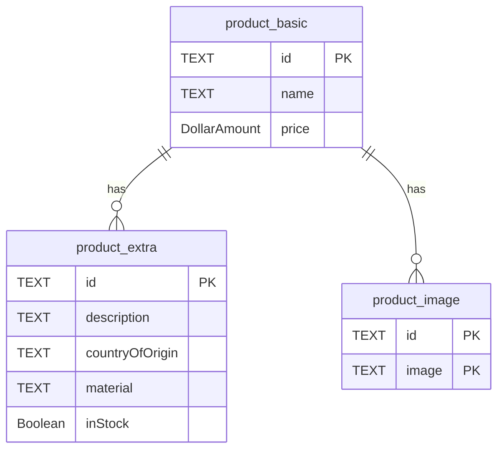

# ProductDatabase Documentation

This document provides an overview of the `ProductDatabase` schema, including table structures and an Entity-Relationship (ER) diagram.

## Schema Definition

The database schema is defined in `ProductDatabase.sq` and consists of the following tables:

*   `product_basic`: Stores basic product information.
*   `product_extra`: Stores additional details for products.
*   `product_image`: Stores image URLs associated with products.

## Tables

### `product_basic`

| Column | Type         | Constraints        |
| :----- | :----------- | :----------------- |
| id     | TEXT         | PRIMARY KEY, NOT NULL |
| name   | TEXT         | NOT NULL           |
| price  | DollarAmount | NOT NULL           |

### `product_extra`

| Column          | Type    | Constraints                             |
| :-------------- | :------ | :-------------------------------------- |
| id              | TEXT    | PRIMARY KEY, NOT NULL                   |
| description     | TEXT    |                                         |
| countryOfOrigin | TEXT    |                                         |
| material        | TEXT    |                                         |
| inStock         | Boolean | NOT NULL                                |
| _Foreign Keys_  |         | `FOREIGN KEY (id) REFERENCES product_basic(id)` |

### `product_image`

| Column         | Type   | Constraints                             |
| :------------- | :----- | :-------------------------------------- |
| id             | TEXT   | NOT NULL                                |
| image          | TEXT   | NOT NULL                                |
| _Primary Key_  |        | `PRIMARY KEY (id, image)`               |
| _Foreign Keys_ |        | `FOREIGN KEY (id) REFERENCES product_basic(id)` |

## Queries

The following queries are defined:

*   `getProductPreviews`: Retrieves a list of product previews, including id, name, price, and a thumbnail image.
*   `getProductById`: Retrieves detailed information for a specific product by its id, including all its images.
*   `insertProductBasic`: Inserts or replaces a record in the `product_basic` table.
*   `insertProductExtra`: Inserts or replaces a record in the `product_extra` table.
*   `insertProductImage`: Inserts or replaces a record in the `product_image` table.

## ER Diagram

