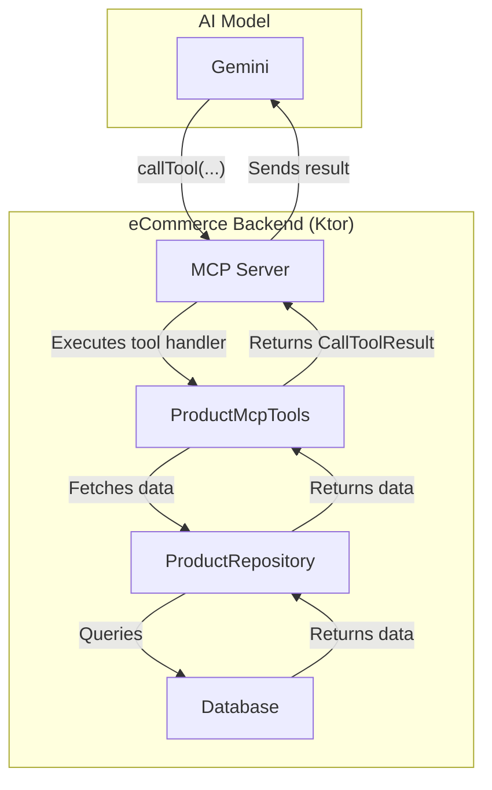
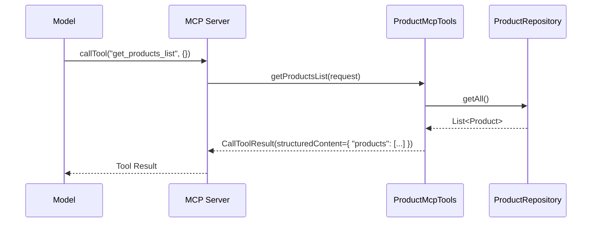
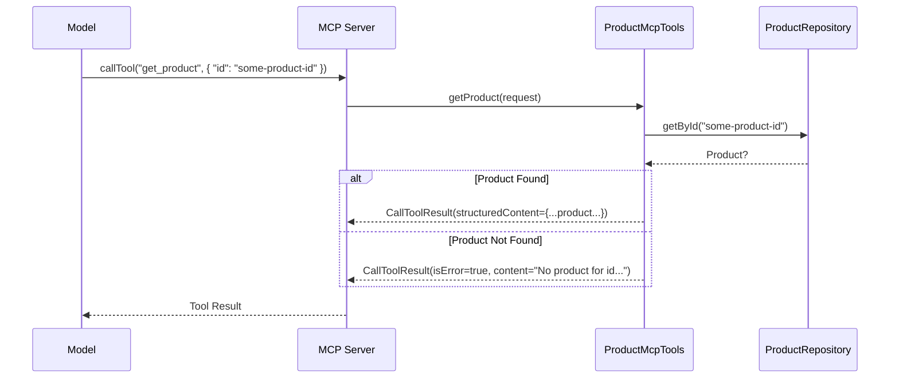

# Model Context Protocol (MCP) Server Documentation

This document provides an overview of the Model Context Protocol (MCP) server implementation for the eCommerce application. The MCP server exposes a set of tools that allow a model (like Gemini) to interact with the application's data in a structured way.

## 🚀 Overview

The MCP server is integrated into the main Ktor backend application. It leverages the `io.modelcontextprotocol.kotlin.sdk` to define and handle tool calls. The primary purpose of this server is to provide a programmatic interface for AI models to query product information from the e-commerce database.

## 🏛️ Architecture

The MCP server acts as a bridge between the AI model and the application's business logic (specifically, the `ProductRepository`). When the model needs to access data, it makes a "tool call" to the MCP server, which then executes the corresponding logic and returns the result.



### Initialization

The MCP server is configured and initialized within the Ktor application lifecycle using an extension function `Application.configureMcp()`. This function sets up the server, defines its capabilities, and registers the available tools from the `ProductMcpTools` class.

*Source: `server/src/main/kotlin/dev/aoriani/ecomm/Application.kt`*

```kotlin
private fun Application.configureMcp() {
    mcp {
        Server(
            serverInfo = Implementation("ecomm-mcp-server", "0.0.1"),
            options = ServerOptions(
                capabilities = ServerCapabilities(
                    tools = ServerCapabilities.Tools(listChanged = null)
                )
            )
        ).apply {
            val repository: ProductRepository by dependencies
            ProductMcpTools(repository).installTools(this)
        }
    }
}
```

## 🛠️ Available Tools

The tools are defined in the `ProductMcpTools` class. This class encapsulates the logic for handling requests for product information.

*Source: `server/src/main/kotlin/dev/aoriani/ecomm/mcp/ProductMcpTools.kt`*

### Product Schema

Both tools return data that conforms to the following `Product` schema. This schema defines the structure of a single product object.

| Field             | Type      | Description                               |
| ----------------- | --------- | ----------------------------------------- |
| `id`              | `string`  | Unique identifier for the product.        |
| `name`            | `string`  | Name of the product.                      |
| `price`           | `number`  | Unit price of the product.                |
| `description`     | `string`  | Detailed text description of the product. |
| `images`          | `array`   | Array of image URLs for the product.      |
| `material`        | `string`  | Material the product is made of.          |
| `inStock`         | `boolean` | Indicates if the product is in stock.     |
| `countryOfOrigin` | `string`  | Country where the product is made.        |

---

### 1. `get_products_list`

This tool retrieves a complete list of all products available in the catalog.

-   **Description**: Retrieves all products in the catalog. Takes no input parameters and returns an object with a 'products' array.
-   **Input Schema**: None.
-   **Output Schema**: An object containing a `products` array. Each item in the array is a product object that conforms to the [Product Schema](#product-schema).

#### Interaction Flow



---

### 2. `get_product`

This tool retrieves the details of a single product, identified by its unique ID.

-   **Description**: Retrieves details of a single product identified by a unique product ID.
-   **Input Schema**: An object with a required `id` property (string).
-   **Output Schema**: A product object that conforms to the [Product Schema](#product-schema).

#### Interaction Flow

