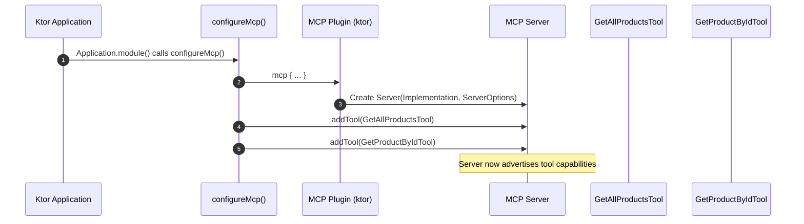
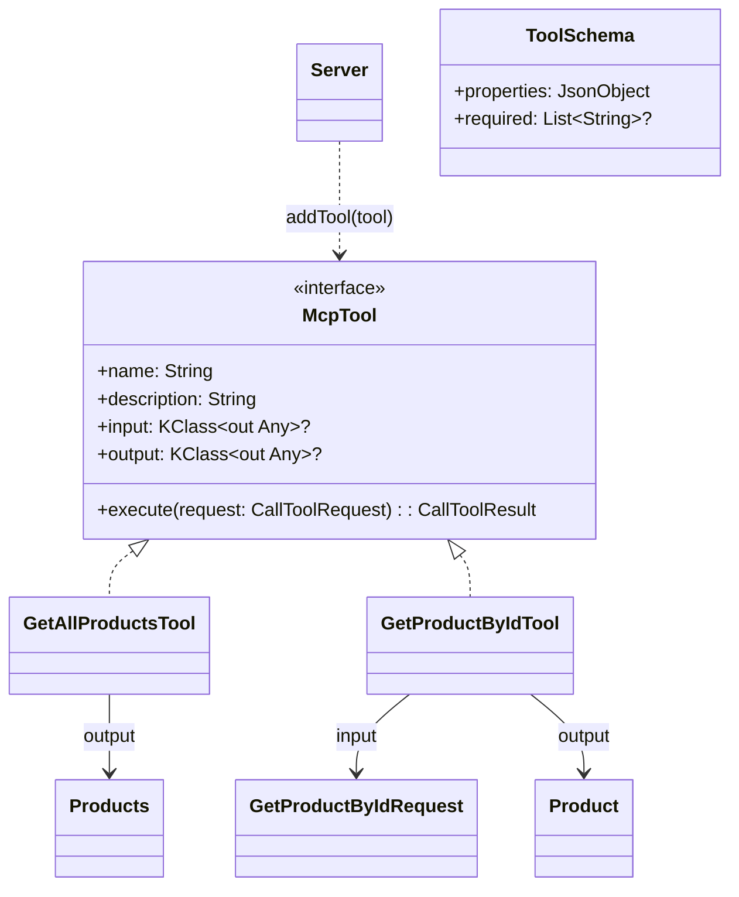
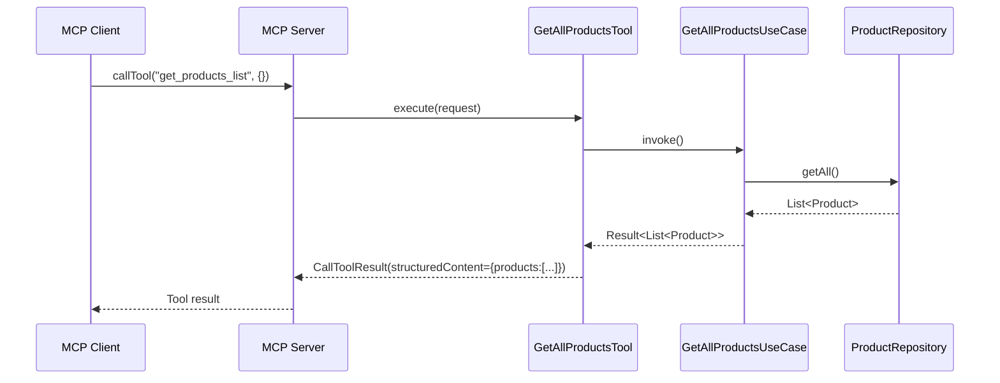
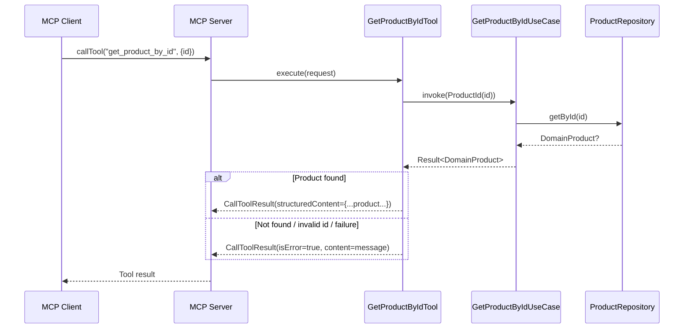
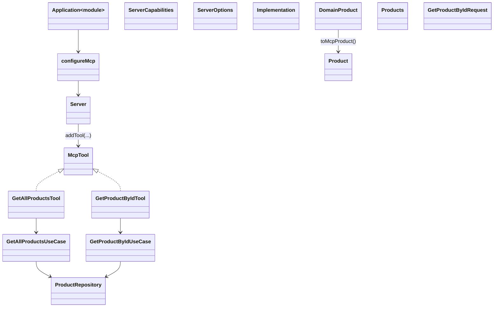

# MCP implementation explanation

This document explains how the Model Context Protocol (MCP) server is implemented in the Ktor-based server of this repository and how the available tools are wired to the domain layer.

Relevant sources:
- server/src/main/kotlin/dev/aoriani/ecomm/Application.kt
- server/src/main/kotlin/dev/aoriani/ecomm/config/mcp.kt
- server/src/main/kotlin/dev/aoriani/ecomm/presentation/mcp/tools/
- server/src/main/kotlin/dev/aoriani/ecomm/presentation/mcp/models/
- server/src/main/resources/application.yaml

## High-level overview

The MCP server is embedded in the Ktor application. On startup, the application configures the MCP server and registers tools that expose product-related capabilities to MCP clients.



Application entry point wiring:

```kotlin
// server/src/main/kotlin/dev/aoriani/ecomm/Application.kt
fun Application.module() {
    configureDatabase()
    configureCallLogging()
    configureCaching()
    configureCompression()
    configureCors()
    configureGraphQL()
    configureMcp()      // <-- MCP setup happens here
    configureRouting()
    configureStatusPages()
}
```

## MCP server configuration

The server is configured in `configureMcp()`:

```kotlin
// server/src/main/kotlin/dev/aoriani/ecomm/config/mcp.kt
internal fun Application.configureMcp() {
    val serverName = environment.config.property("ecomm.mcp.server-name").getString()
    val serverVersion = environment.config.property("ecomm.mcp.server-version").getString()
    mcp {
        Server(
            serverInfo = Implementation(serverName, serverVersion),
            options = ServerOptions(
                capabilities = ServerCapabilities(
                    tools = ServerCapabilities.Tools(listChanged = null)
                )
            )
        ).apply {
            val getAllProductsUseCase: GetAllProductsUseCase by dependencies
            val getProductByIdUseCase: GetProductByIdUseCase by dependencies
            addTool(GetAllProductsTool(getAllProductsUseCase))
            addTool(GetProductByIdTool(getProductByIdUseCase))
        }
    }
}
```

Configuration values are provided by `application.yaml`:

```yaml
# server/src/main/resources/application.yaml
ecomm:
  mcp:
    server-name: "ecomm-mcp-server"
    server-version: "0.0.1"
```

## Tool abstraction and registration

Tools implement a small contract exposed via `McpTool` and are registered on the MCP server through an extension that also generates JSON Schemas for input/output based on `kotlinx.serialization` descriptors.



Key code:

```kotlin
// server/src/main/kotlin/dev/aoriani/ecomm/presentation/mcp/tools/McpTool.kt
interface McpTool {
    val name: String
    val description: String
    val input: KClass<out Any>?
    val output: KClass<out Any>?
    suspend fun execute(request: CallToolRequest): CallToolResult
}

internal fun Server.addTool(tool: McpTool) {
    val toolInputSchema = tool.input?.toToolSchema()
    val toolOutputSchema = tool.output?.toToolSchema()

    addTool(
        name = tool.name,
        description = tool.description,
        inputSchema = toolInputSchema?.let { Tool.Input(it.properties, it.required) } ?: Tool.Input(),
        outputSchema = toolOutputSchema?.let { Tool.Output(it.properties, it.required) },
        handler = tool::execute,
    )
}

internal fun KClass<out Any>.toToolSchema(): ToolSchema {
    val ktype = this.createType()
    val kserializer = serializer(ktype)
    val jsonSchema = generateSchema(descriptor = kserializer.descriptor, inlineRefs = true)
    val jsonObjectSchema = Json.encodeToJsonElement(jsonSchema).jsonObject
    val schema = requireNotNull(jsonObjectSchema["properties"]?.jsonObject) { "schema does not contain properties" }
    val required = jsonObjectSchema["required"]?.jsonArray?.map { it.jsonPrimitive.content }
    return ToolSchema(schema, required)
}
```

Notes:
- JSON Schema generation uses `com.xemantic.ai.tool.schema.generator.generateSchema` and honors `@Serializable` plus `@Title`/`@Description` metadata found on model classes.
- The resulting schemas are passed to the MCP SDK as `Tool.Input` and `Tool.Output` for client validation and introspection.

## Models and serialization

The MCP-facing models live under `presentation/mcp/models`. They mirror the domain product shape and include metadata and custom serializers where needed.

```kotlin
// server/src/main/kotlin/dev/aoriani/ecomm/presentation/mcp/models/Product.kt
@Serializable
@Title("Product")
@Description("Represents a product available in the e-commerce catalog.")
data class Product(
    val id: String,
    val name: String,
    @Serializable(with = BigDecimalPriceSerializer::class)
    val price: BigDecimal,
    val description: String,
    val images: List<String>,
    val material: String,
    val inStock: Boolean,
    val countryOfOrigin: String
)

@Serializable
@Title("Products")
@Description("Represents the list of product available in the e-commerce catalog.")
data class Products(val products: List<Product>)

@Serializable
@Title("GetProductByIdRequest")
@Description("Request to get a product by its unique identifier.")
data class GetProductByIdRequest(val id: String)
```

The `price` field is serialized using a custom serializer to ensure 2-decimal encoding:

```kotlin
// server/src/main/kotlin/dev/aoriani/ecomm/presentation/mcp/models/BigDecimalPriceSerializer.kt
object BigDecimalPriceSerializer : KSerializer<BigDecimal> {
    override val descriptor = PrimitiveSerialDescriptor("java.math.BigDecimal", PrimitiveKind.DOUBLE)
    override fun serialize(encoder: Encoder, value: BigDecimal) =
        encoder.encodeDouble(value.setScale(2, RoundingMode.HALF_EVEN).toDouble())
    override fun deserialize(decoder: Decoder): BigDecimal = BigDecimal(decoder.decodeString())
}
```

## Implemented tools

### 1) get_products_list
- Class: `GetAllProductsTool`
- Input: none
- Output: `Products`
- Behavior: Invokes `GetAllProductsUseCase`. On success, returns a `structuredContent` JSON object with the list of products and human-readable `TextContent` lines; on failure, returns `isError = true`.



### 2) get_product_by_id
- Class: `GetProductByIdTool`
- Input: `GetProductByIdRequest` (id: String)
- Output: `Product`
- Behavior: Validates the input `id`, invokes `GetProductByIdUseCase`, and returns the mapped product or a well-formed error (handles `ProductNotFoundException` and `BlankProductIdException`).



## End-to-end class map



## Adding a new MCP tool

1. Define MCP-facing input/output models under `presentation/mcp/models` using `@Serializable` and optional `@Title`/`@Description`.
2. Implement `McpTool` with:
   - `name` and `description` (what the tool does)
   - `input`/`output` KClass types (for schema generation)
   - `execute(request)` logic that returns `CallToolResult`
3. Register the tool in `configureMcp()` using `Server.addTool(newTool)`.
4. Wire any required domain use cases via DI (`val useCase: YourUseCase by dependencies`).
5. Add tests under `server/src/test/...` to verify behavior and schema generation if needed.

## Notes and considerations

- Capabilities: The server advertises tool support via `ServerCapabilities(tools = ...)`. Clients can introspect available tools and their schemas.
- Structured vs. text content: Tools return both human-friendly `TextContent` and `structuredContent` (JSON) to support different client needs.
- Error handling: Tools consistently set `isError = true` and provide a short message in `content` for recoverable errors.
- Schema generation: The approach ensures the declared Kotlin models are the source of truth for MCP tool schemas.

