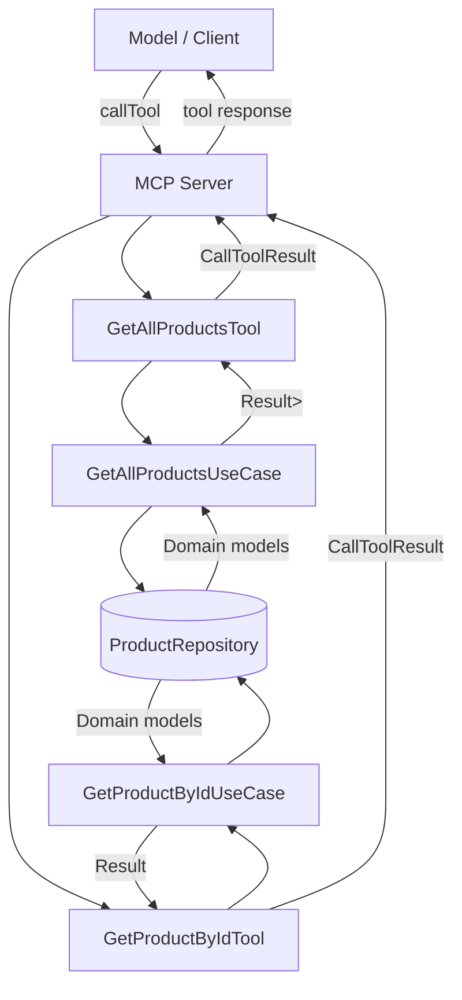
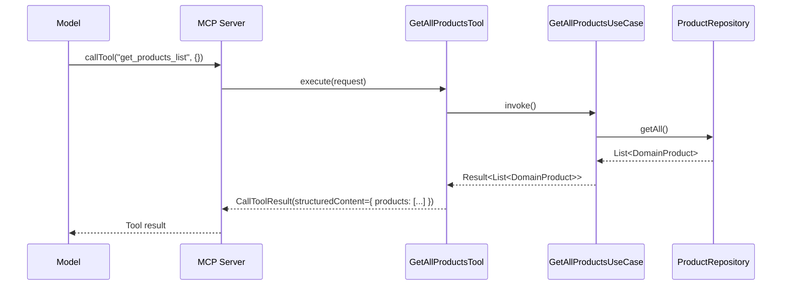
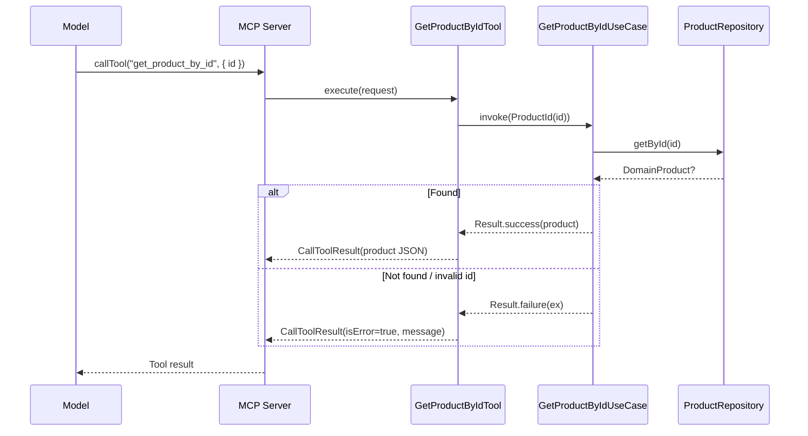
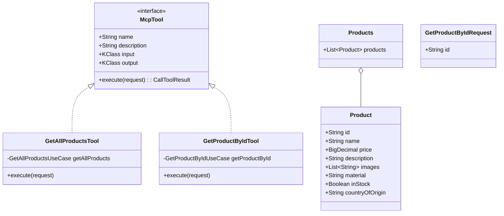

# MCP Implementation Explanation

This document explains how the Model Context Protocol (MCP) is implemented in the server module of this repository, focusing on the components, data flow, schemas, and how tools are exposed to models.

The implementation lives under `server/` and integrates with the Ktor backend. It uses the io.modelcontextprotocol.kotlin.sdk to define a server that exposes tools for product queries.

---

## High-level overview

- Ktor application boots the MCP server during startup.
- Two MCP tools are registered:
  - `get_products_list` to list all products.
  - `get_product_by_id` to fetch a single product by id.
- Tools delegate to domain use cases, which access the product repository (database, hardcoded or fake impls).
- Each tool returns both human-readable text and structured JSON content.



---

## Where it is configured

File: `server/src/main/kotlin/dev/aoriani/ecomm/config/mcp.kt`

```kotlin
internal fun Application.configureMcp() {
    val serverName = environment.config.property("ecomm.mcp.server-name").getString()
    val serverVersion = environment.config.property("ecomm.mcp.server-version").getString()
    mcp {
        Server(
            serverInfo = Implementation(serverName, serverVersion),
            options = ServerOptions(
                capabilities = ServerCapabilities(
                    tools = ServerCapabilities.Tools(listChanged = null)
                )
            )
        ).apply {
            val getAllProductsUseCase: GetAllProductsUseCase by dependencies
            val getProductByIdUseCase: GetProductByIdUseCase by dependencies
            addTool(GetAllProductsTool(getAllProductsUseCase))
            addTool(GetProductByIdTool(getProductByIdUseCase))
        }
    }
}
```

- Uses Ktor extension `mcp { ... }` to mount an MCP Server.
- Declares capabilities (tools are supported).
- Resolves use case instances via Ktor DI.
- Registers tools with `Server.addTool(McpTool)` helper.

Configuration values come from `server/src/main/resources/application.yaml`:

```yaml
ecomm:
  mcp:
    server-name: "ecomm-mcp-server"
    server-version: "0.0.1"
```

---

## Tools contract and registration

File: `server/src/main/kotlin/dev/aoriani/ecomm/presentation/mcp/tools/McpTool.kt`

- `McpTool` interface defines:
  - `name`, `description` for MCP metadata.
  - Optional `input` and `output` KClass to auto-generate JSON Schemas.
  - `suspend fun execute(request: CallToolRequest): CallToolResult`.
- `Server.addTool(tool: McpTool)` helper:
  - Generates schemas using `com.xemantic.ai.tool.schema.generator.generateSchema` + kotlinx.serialization.
  - Registers tool with the MCP SDK, wiring handler to `tool::execute`.

Key snippet (simplified):

```kotlin
internal fun Server.addTool(tool: McpTool) {
    val inSchema = tool.input?.toToolSchema()
    val outSchema = tool.output?.toToolSchema()

    addTool(
        name = tool.name,
        description = tool.description,
        inputSchema = inSchema?.let { Tool.Input(it.properties, it.required) } ?: Tool.Input(),
        outputSchema = outSchema?.let { Tool.Output(it.properties, it.required) },
        handler = tool::execute,
    )
}
```

Schema extraction:

```kotlin
internal fun KClass<out Any>.toToolSchema(): ToolSchema {
    val kserializer = serializer(this.createType())
    val jsonSchema = generateSchema(descriptor = kserializer.descriptor, inlineRefs = true)
    val jsonObjectSchema = Json.encodeToJsonElement(jsonSchema).jsonObject
    val props = requireNotNull(jsonObjectSchema["properties"]?.jsonObject)
    val required = jsonObjectSchema["required"]?.jsonArray?.map { it.jsonPrimitive.content }
    return ToolSchema(props, required)
}
```

This ensures MCP clients can introspect the tool interface and perform validation.

---

## Tool: get_products_list

File: `server/src/main/kotlin/dev/aoriani/ecomm/presentation/mcp/tools/GetAllProductsTool.kt`

- Name: `get_products_list`
- Input schema: none (input = null)
- Output schema: `Products` (wrapper with `products: List<Product>`)
- Behavior:
  - Invokes `GetAllProductsUseCase`.
  - On success: returns
    - Text content: one TextContent per product (human-readable)
    - Structured content: JSON object of `Products`
  - On failure: returns `isError = true` with a short message.

Sequence:



---

## Tool: get_product_by_id

File: `server/src/main/kotlin/dev/aoriani/ecomm/presentation/mcp/tools/GetProductByIdTool.kt`

- Name: `get_product_by_id`
- Input schema: `GetProductByIdRequest` with `id: string`
- Output schema: `Product`
- Behavior:
  - Decodes `request.arguments` into `GetProductByIdRequest`.
  - Validates `id` is not blank; error if blank.
  - Invokes `GetProductByIdUseCase(ProductId(id))`.
  - On success: returns
    - Text content: product as string
    - Structured content: product as JSON
  - On failure: maps domain exceptions to user-friendly errors:
    - `ProductNotFoundException` -> "Product not found: {id}"
    - `BlankProductIdException` -> exception message
    - Other -> generic error and logs it.

Sequence:



---

## MCP models and schemas

File: `server/src/main/kotlin/dev/aoriani/ecomm/presentation/mcp/models/Product.kt`

- `@Serializable` models used to generate schemas:
  - `Product`: id, name, price (BigDecimal serialized by custom serializer), description, images, material, inStock, countryOfOrigin
  - `Products`: wrapper with `products: List<Product>`
  - `GetProductByIdRequest`: `{ id: string }`
- The custom `BigDecimalPriceSerializer` ensures BigDecimal is encoded as a JSON string/number suitable for schema and transport.
- Mapping from domain to MCP model via `DomainProduct.toMcpProduct()`.

Class diagram (simplified):



---

## Error handling strategy

- Tools return `CallToolResult(isError = true, content = [TextContent(...)])` for errors.
- Domain-layer exceptions are translated to readable messages; unexpected errors are logged and surfaced as generic messages.
- Success responses include both `content` (text) and `structuredContent` (JSON object) to serve both conversational and programmatic clients.

---

## How everything wires together at runtime

File: `server/src/main/kotlin/dev/aoriani/ecomm/Application.kt` ensures `configureMcp()` is called during startup alongside other Ktor features.

```kotlin
fun Application.module() {
    configureDatabase()
    configureCallLogging()
    configureCaching()
    configureCompression()
    configureCors()
    configureGraphQL()
    configureMcp()
    configureRouting()
    configureStatusPages()
}
```

The MCP server therefore boots with the rest of the app, sharing the same DI container and configuration.

---

## Notes and extensibility

- Adding a new tool only requires:
  1) Implementing `McpTool` with input/output models annotated with `@Serializable`.
  2) Registering it in `configureMcp()` via `addTool(MyTool(...))`.
- Schema generation is automatic; ensure your models are serializable and (optionally) annotated with `@Title` and `@Description` for better documentation.
- Tools can return both text and structured JSON; prefer structured JSON for deterministic integrations.

---

## References

- io.modelcontextprotocol.kotlin.sdk
- com.xemantic.ai.tool.schema.generator
- Ktor server
