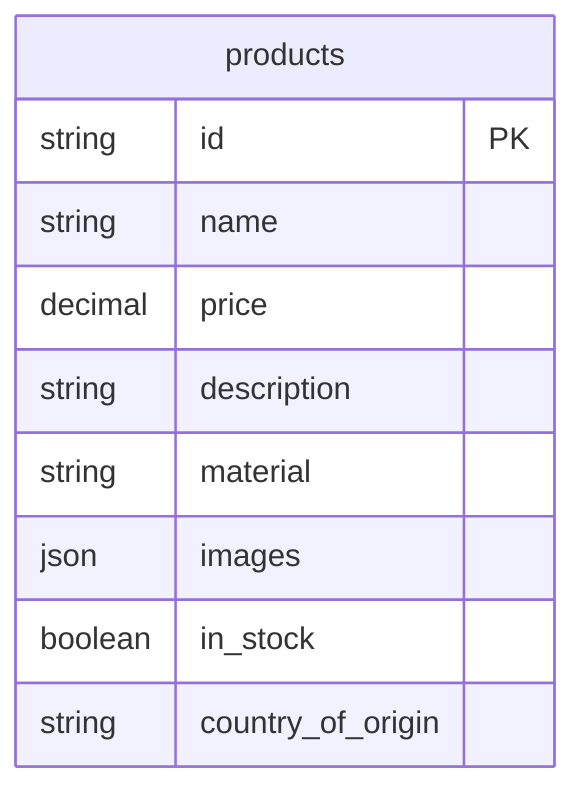

# Database Module Documentation

This document provides a comprehensive overview of the database layer for the e-commerce application, specifically focusing on the product data model. This layer is built using Kotlin and the Exposed library for database interactions.

## Architecture

The database module is responsible for all interactions with the underlying data store for products. It follows a simple repository pattern, where the `DatabaseProductRepositoryImpl` acts as the single source of truth for product data.

The key components are:

*   **`ProductTable`**: Defines the schema for the `products` table using the Exposed DSL.
*   **`ProductEntity`**: Represents a single row in the `products` table, providing an object-oriented way to interact with product data.
*   **`DatabaseProductRepositoryImpl`**: Implements the `ProductRepository` interface, providing methods to query the database for products.

## File Breakdown

### `ProductTable.kt`

This file defines the structure of the `products` table.

*   **`ProductTable` object**: An `IdTable` from Exposed, defining the columns of the `products` table.
*   **Columns**:
    *   `id`: `varchar` (Primary Key)
    *   `name`: `varchar`
    *   `price`: `decimal`
    *   `description`: `text`
    *   `material`: `varchar`
    *   `images`: `json` (stores a list of image URLs)
    *   `inStock`: `bool`
    *   `countryOfOrigin`: `varchar`
*   **`initializeSchema()`**: A function to create the `products` table if it doesn't exist.
*   **`doSeedData()`**: A private function to populate the table with initial sample data.
*   **`initializeDatabaseAndSeedIfEmpty()`**: The main function to set up the database, creating the schema and seeding it with data if the table is empty.

### `ProductEntity.kt`

This file defines the `ProductEntity` class, which is an Exposed `Entity`. It maps a row from the `ProductTable` to a `ProductEntity` object, allowing for easy access to its properties.

### `DatabaseProductRepositoryImpl.kt`

This file contains the implementation of the `ProductRepository` interface.

*   **`DatabaseProductRepositoryImpl` object**: A singleton object that implements the `ProductRepository`.
*   **`getAll()`**: Retrieves all products from the database.
*   **`getById(id: String)`**: Retrieves a single product by its ID.
*   **`toProduct()`**: A private extension function to convert a `ProductEntity` to a `Product` model from the GraphQL layer.

## Database Schema

The following Mermaid diagram illustrates the schema of the `products` table:

## Initialization and Seeding

The database is initialized and seeded by calling the `initializeDatabaseAndSeedIfEmpty()` function from `ProductTable.kt`. This function should be called at application startup. It ensures that the `products` table is created and, if it is empty, populates it with a set of predefined products.
